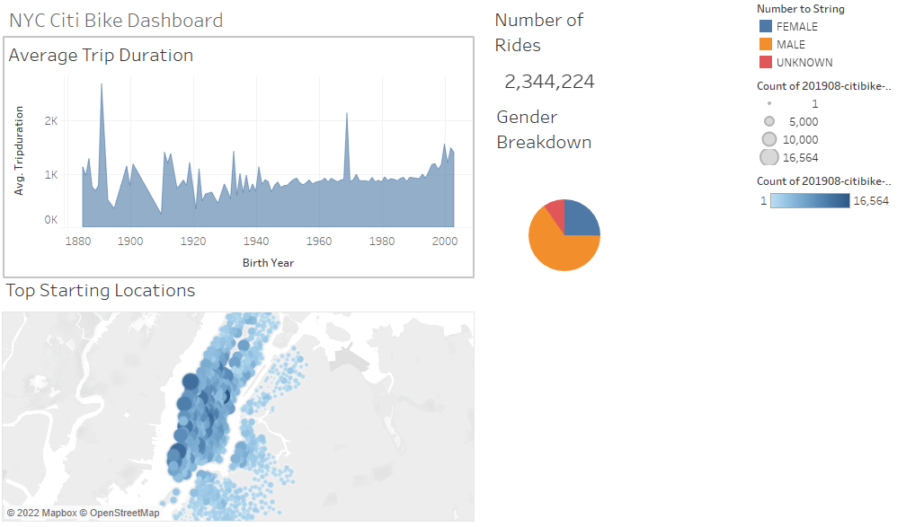
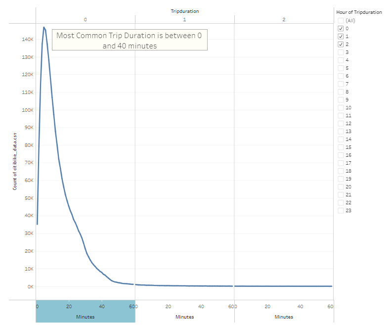
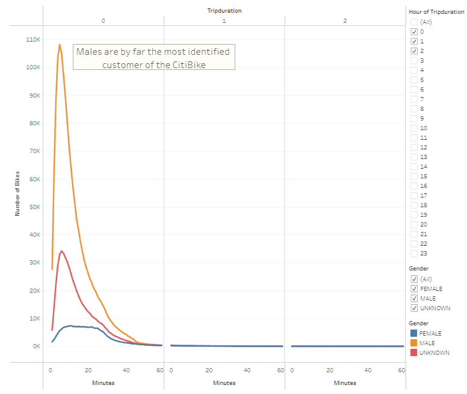
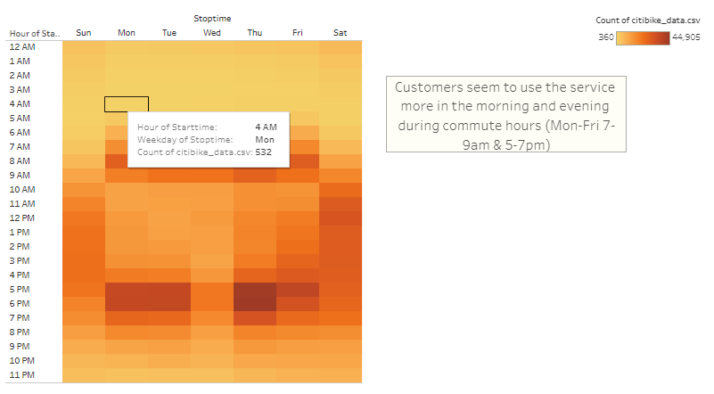
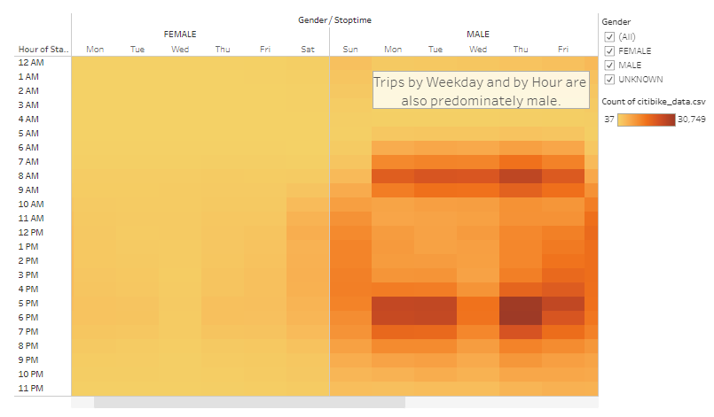
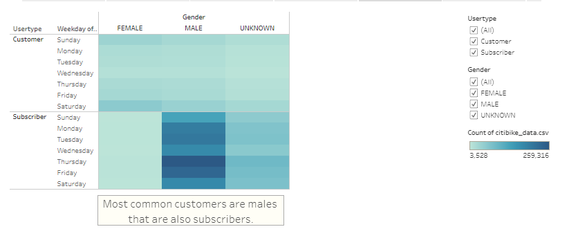
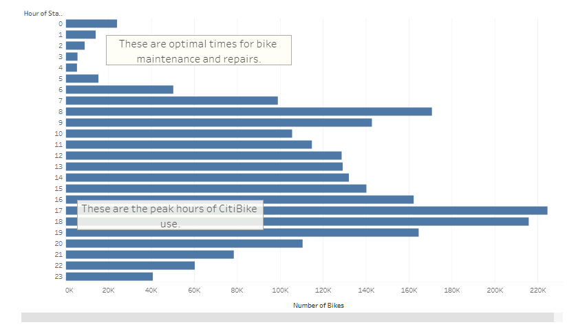
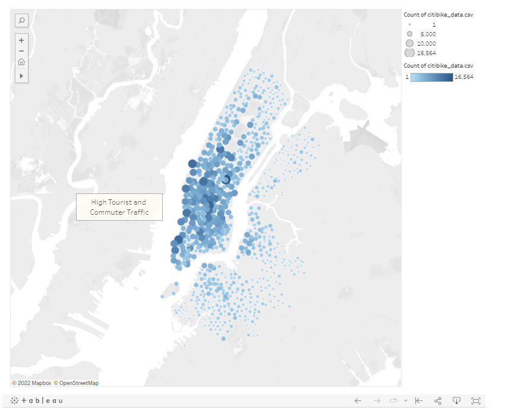

# Bikesharing with NYC CitiBike

## Overview
An analysis of August 2019 CitiBike bikesharing data by creating visualizations in Tableau.

Full CitiBike Tableau story can be seen here: [Dashboard](https://public.tableau.com/app/profile/brittney.r.stanley/viz/CitiBikeChallenge_16549932656150/NYCCitiBike?publish=yes)

### Data Analyzed from Bikesharing Data
1. Gender and User Types of Bikesharing Program
2. Area of the city used most for start and end commutes
3. Days of the Week and Hours of the Days bikesharing is used most often

## Results

### Dashboard Created for Overall Demographics of Bikesharing Use

This is an Dashboard created with 4 different visualizations created on separate sheets then added to a central document to show an overall view of basic demographics of the Bikesharing data.

### Tableau Story Visualizations
The Tableau Story function is a little different from the Dashboard where you can add one sheet per page to create `Story Points` to focus on. Below are snapshots of my Tableau Story for the Bikesharing data.

#### Page 1: Checkout Time for Users

#### Page 2: Checkout Time by Gender

The first page shows the most common duration of bikesharing is between 0 and 40 minutes. The second page shows the same data but separated by gender to show males are the most identified customer that uses the bikesharing service.

#### Page 3: Trips by Weekday per Hour

#### Page 4: Trips by Gender (Weekday per Hour)

The third page shows trips taken by the bikesharing customers during each day of the week and the hours they occurred. The fourth page shows the same data but separated by gender, shows that the data is mostly from the male customers.

#### Page 5: User Trips by Gender by Weekday

The fifth page shows the most common customers are male, subscribers and use the service more on Thursdays and Fridays.

#### Page 6: August Peak Hours

The sixth page shows the August Peak Hours of when the bikesharing is used most. The data shows between midnight and 4 AM are the best times for bike maintenance and repairs. From 4PM to 7PM the bikesharing is used the most.

#### Page 7: Top Starting Locations

The final page shows a map based off of the longitude and latitude of the area bikesharing is most utilized. This is a highly commuted area.

## Summary
In conclusion of the above data, it is evident the bikesharing service is utilized in metropolitan type areas where people are densely packed in the city. Most of the customers/subscribers are male, and the bikesharing is used most during commuting hours.

Two additional visualizations that could be utilized with this data:
1. Using the average trip duration with gender and birth year to fully understand why the bikesharing is predominately used by males. This would help advertise to the right demographic in order to encourage more female riders.
2. Pulling data for different months of the year and understand the correlation between the time of the year and number of riders.
